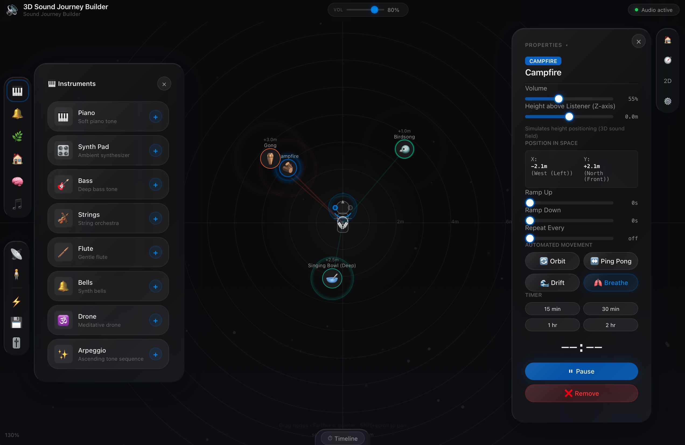
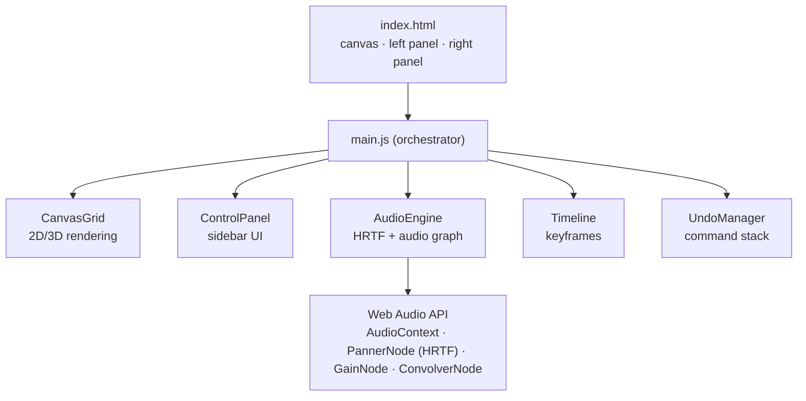

# 3D Sound Journey Builder

[](https://github.com/leopardcodeai/3d-sound-journey-builder/actions)
[](https://3d-sound-journey-builder.vercel.app)
[](https://github.com/leopardcodeai/3d-sound-journey-builder)

An interactive **spatial audio experience builder** that runs entirely in the browser. Place instruments, nature sounds, and ambient textures on a 2D/3D canvas — each with its own position in space, volume, elevation, and animation path. Design multi-minute sound journeys with keyframe-based spatial animation, then export and share.

Every sound source is rendered as it would be experienced inside your head: HRTF spatialization with head/shoulder/pinna modeling, posture physics (standing, lying back, lateral), and real-time AirPods head tracking via Web Bluetooth.

**Live demo:** [3d-sound-journey-builder.vercel.app](https://3d-sound-journey-builder.vercel.app)

Built and maintained by [LeopardCode.AI](https://leopardcode.ai) — an experiment in fully agentic AI development using Chinese AI models (Qwen3.6 Plus).



---

## Features

| Feature | Details |
|---------|---------|
| **Spatial 3D audio** | HRTF convolution, shoulder/pinna/torso scattering, posture physics |
| **2D/3D canvas** | Isometric projection, camera orbit/pan/zoom, particle fog, ripple effects |
| **45+ sound presets** | Instruments (piano, synth pad, bass, strings, flute, drone, arpeggio), nature (rain, thunder, waves, birds, crickets, campfire), urban (café, subway, traffic), jungle (monkeys, elephants, leopard, river), ocean (whales, dolphins, deep ambient), singing bowls (8 tones), brainwave frequencies (alpha, beta, theta, delta, gamma) |
| **Activity presets** | Focus, meditation, sleep, relaxation, energy — instant multi-source scenes |
| **Template scenes** | Jungle night, ocean deep, cosmic soundscape, urban thunderstorm, morning ritual, sound therapy |
| **Timeline editor** | Multi-track keyframe editor with zoom, pan, play/pause/loop, 0–600 s range |
| **Keyframe animation** | Spatial paths with linear/ease-in/ease-out interpolation, volume automation |
| **Undo/redo** | 20-step Command Pattern stack with keyboard shortcuts (Cmd+Z / Cmd+Shift+Z) |
| **Head tracking** | AirPods gyroscope → real-time listener rotation via Web Bluetooth |
| **Speaker mode** | 2.0–7.1 channel configurations with custom speaker placement |
| **Z-height** | Per-source 3D elevation (±10 m range) |
| **Automations** | Orbit, ping-pong, drift, and breathe motion paths |
| **Ramp controls** | Per-source fade-in/fade-out and repeat intervals |
| **Soundscape timer** | Countdown with automatic scene stop |
| **Scene sharing** | Export/import via URL-encoded state |
| **i18n-ready** | English + German translations prepared |

---

## Quick Start

```bash
npm install        # install dependencies
npm run dev        # dev server with hot reload
npm test           # run the test suite (104/104 ✓)
npm run build      # production build
npm run preview    # preview the production build
```

---

## Tech Stack

| Layer | Technology |
|-------|-----------|
| **Runtime** | Vanilla JavaScript (ES modules, no framework) |
| **Spatial audio** | Web Audio API — HRTF convolution, custom HRIR tables, PannerNode, ConvolverNode |
| **Rendering** | Canvas 2D with custom isometric 3D projection, particle fog, ripple physics |
| **Timeline** | Keyframe interpolation (linear/ease-in/ease-out), zoomable ruler |
| **State management** | Command Pattern (UndoManager), Map-based source registry |
| **Head tracking** | Web Bluetooth + AirPods IMU → quaternion → listener rotation |
| **Testing** | Vitest + jsdom — 104 unit tests across 7 modules |
| **Build & deploy** | Vite → Vercel edge |
| **Browser automation** | Playwright (agent self-testing) |

## Architecture



---

## How It Was Built

This project is an experiment in **fully agentic AI development**: Qwen3.6 Plus generated 100% of the code through an iterative conversation loop — intent in, code out, test, deploy, repeat.

- **No scaffolding** — `npm init` was the only boilerplate
- **No upfront architecture** — the structure emerged from feature conversations
- **No ticketing system** — the AI agent acted as its own project manager
- **Human role** — intent definition, design review, final approval

### The self-testing loop

A notable result: the agent debugged its own output autonomously. When the canvas rendered black, it installed Playwright, wrote scripts to screenshot the live app, traced the failure to an invalid RGBA string produced by a `.replace()` chain, implemented a `_withAlpha()` color helper, then tested, verified, and deployed the fix — without human intervention.

### Engineering notes

As an AI-built experiment, the codebase reflects its origin: some files grew organically past 500 lines, naming mixes German and English, and state lives largely in the AudioContext graph rather than a centralized store. The goal was not textbook architecture — it was measuring how far an AI agent can take a real product with nothing but intent and a feedback loop. The 104-test suite keeps it honest.

---

## License

MIT — see [LICENSE](LICENSE).

---

<p align="center">
  <sub>Built with agentic coding by <a href="https://leopardcode.ai">LeopardCode.AI</a> (<a href="https://github.com/leopardcodeai">github.com/leopardcodeai</a>)</sub>
</p>
