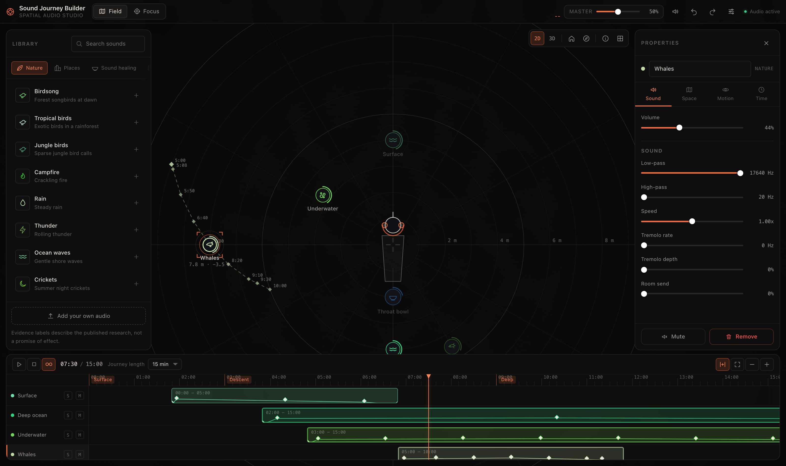
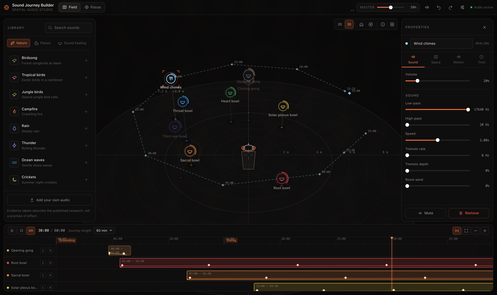
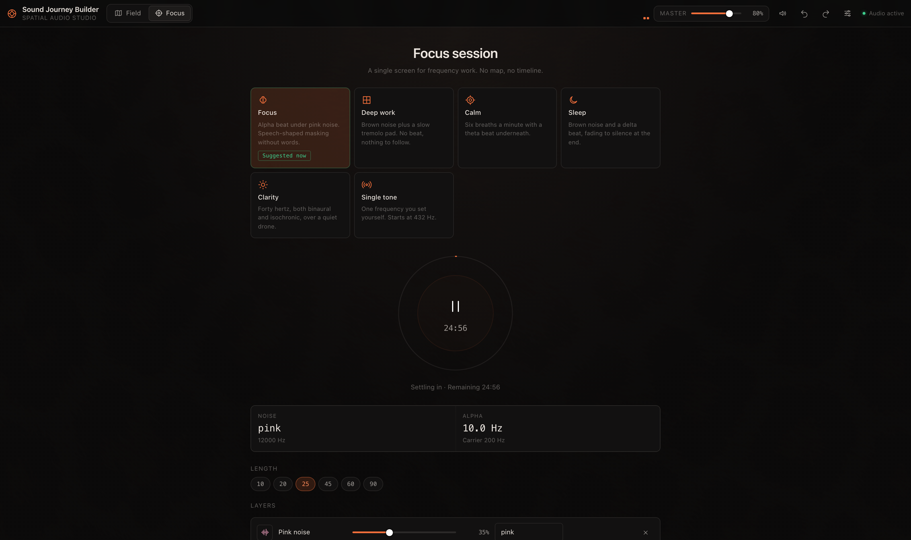
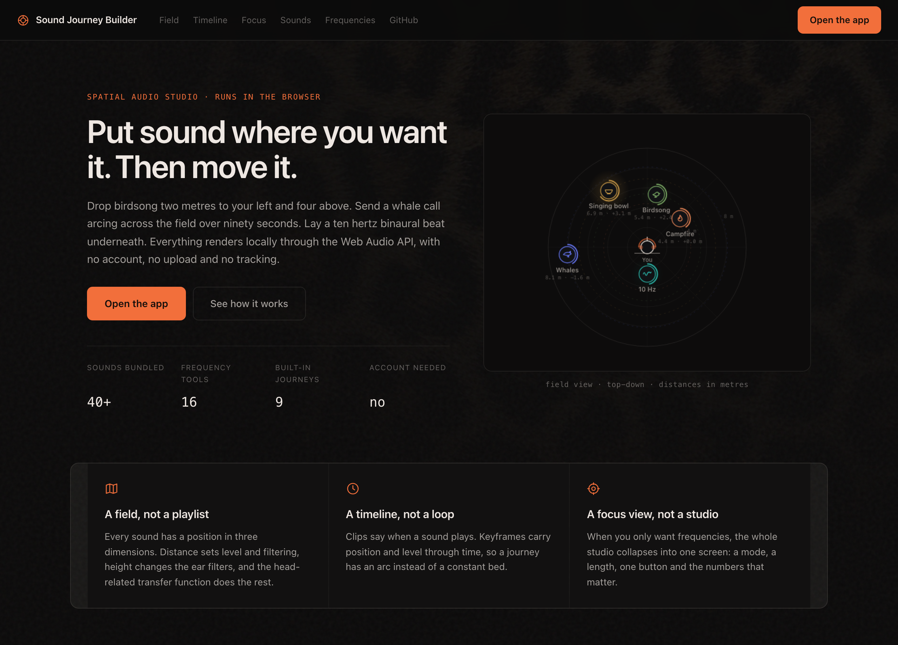

# Sound Journey Builder

[](https://github.com/leopardcodeai/3d-sound-journey-builder/actions/workflows/tests.yml)
[](https://3d-sound-journey-builder.vercel.app)
[](LICENSE)

A spatial audio studio that runs entirely in the browser. Place sounds around
your head in three dimensions, move them along a timeline, and layer in
frequency tools that are labelled for what the research actually supports.

No account, no upload, no tracking. Every sample is decoded locally and every
tone is generated in the Web Audio graph.

**Live:** [3d-sound-journey-builder.vercel.app](https://3d-sound-journey-builder.vercel.app)



---

## Two ways to use it

**The field.** A metre-accurate map of the space around your head. Drag a sound
to move it on the ground plane, hold Alt to lift it, right-drag to orbit. The
2D map and the 3D view are one camera blended between orthographic and
perspective, so switching does not cut.



**The focus view.** One screen, one button. Pick a mode and a length, press the
ring. No map, no timeline, and a readout that names every frequency currently
playing.





---

## What is in it

| Area | Detail |
|---|---|
| **Spatial audio** | HRTF panner per source, shoulder and outer-ear filters that track elevation, three listener postures, head tracking through device orientation |
| **Sound library** | Sixty-two entries in seven categories: recorded ambience, sound-healing instruments, offline-rendered instruments, procedural frequency tools, generative layers, and your own files |
| **Synthesised healing set** | The bowl strike, the gong and the seven chakra bowls are generated, not recorded. Each bowl sounds within ten cents of the frequency on its label, and a test measures it |
| **Frequency tools** | Binaural, isochronic and monaural beats, pure and solfeggio tones, white, pink and brown noise, a breathing pacer, a 7.83 Hz pulse. Each carries an evidence label |
| **Per-source inserts** | Low-pass, high-pass, playback speed, tremolo, reverb send, fade in, fade out, repeat cycle |
| **Master bus** | Shared convolution reverb, soft limiter, stereo meters |
| **Timeline** | Clips, draggable keyframes with volume envelopes, mute and solo, named sections, zoom-aware snapping, fit to view |
| **Journeys** | Nine built in, from a twenty-five minute deep-work block to an hour-long sound bath and a thirty minute sleep descent |
| **Focus modes** | Six single-screen sessions with a countdown ring, a live frequency readout, a settling and wind-down phase, and a taper that slows the frequencies on the way out |
| **Output** | Headphones with HRTF, stereo speakers, 5.1, or a custom speaker layout placed by dragging |
| **Editing** | One undo stack across moves, adds, deletes, clip edits, keyframe edits, parameters and motion paths |
| **Sharing** | Scenes in local storage, plus links that carry the whole journey in the URL |
| **Languages** | English and German |

---

## Honest labels

Frequency tools ship with an evidence grade drawn from a literature review kept
in [docs/research](docs/research). The grade describes the published research,
not a promised effect.

| Tool | Grade |
|---|---|
| Pink and white noise, breathing pacer at six breaths a minute | Some evidence |
| Binaural, isochronic and monaural beats, brown noise, 40 Hz gamma | Weak evidence |
| Solfeggio tones, 432 Hz tuning, 7.83 Hz Schumann | No evidence |

Each grade comes with a one-line reason. Select a binaural beat and the
inspector says it needs headphones, and offers to swap it for an isochronic
pulse that survives on speakers.

Forty hertz gamma stimulation has strong evidence in clinical Alzheimer's
trials using combined light and sound devices. That does not transfer to a
wellness audio app, and the app does not claim it does.

This is not a medical device.

---

## Quick start

```bash
npm install
npm run dev        # http://localhost:5199
npm test           # 254 unit tests
npm run build      # landing page + app
npm run audit:audio  # what is in public/sounds, and does the library agree
npm run shoot      # the screenshots in docs/, against a running dev server
```

`shoot` reads four environment variables: `SHOOT_VIEW` (`field`, `3d`, `focus`
or `landing`), `SHOOT_JOURNEY`, `SHOOT_OUT` and `SHOOT_SIZE` (`desktop` or
`mobile`, the 375x812 box the layout breakpoints are written against). The
phone layout in [docs/screenshot_mobile.png](docs/screenshot_mobile.png) comes
from `SHOOT_SIZE=mobile SHOOT_VIEW=field SHOOT_JOURNEY=soundbath`.

`audit:audio` reports every bundled file with its size, duration, encoder and
embedded tags, and fails if the library references a file that is not there or
a file sits unreferenced.

The dev server serves the landing page at `/` and the app at `/app.html`.

---

## Architecture

```
src/
  audio/
    AudioEngine.js      master bus, sources, inserts, analysers, output modes
    Generators.js       procedural sources: binaural, isochronic, monaural,
                        tone, noise, breath, pad, drone, shimmer, schumann
    InstrumentSynth.js  offline-rendered instrument buffers
    SceneManager.js     save, load and share, including generator parameters
    SpeakerConfig.js    headphone and speaker layouts
    HeadTracker.js      device orientation to listener rotation
  core/UndoManager.js   one command stack for every edit
  data/
    SoundLibrary.js     the registry every surface reads from
    Presets.js          journeys with sections, focus modes, static scenes
  ui/
    Camera.js           projection and inverse projection
    CanvasGrid.js       the field: rendering, input, motion paths
    Timeline.js         the journey editor
    Library.js          left panel
    Inspector.js        right panel
    FocusView.js        the single-screen player
    Icons.js            one line-icon set for DOM and canvas
```

### Signal path

```
sample     BufferSource -> LP -> HP -> tremolo -> shoulder -> pinna -> HRTF panner -> gain
generator  generator output ---------------------> shoulder -> pinna -> HRTF panner -> gain
binaural   generator output (stereo, head-locked) ----------------------------------> gain
every      gain -> reverb send -> convolver -> return -> master ; gain -> analyser
master     master -> limiter -> destination ; master -> splitter -> left/right analysers
```

Binaural beats need a different frequency in each ear. Sending them through the
HRTF panner would mix the channels and destroy the beat, so they bypass it and
stay locked to the listener. The inspector says so rather than hiding it.

### Coordinates

World space is metres: x to the right, y forward, z up. Web Audio takes
`(x, z, -y)`. The camera carries yaw, pitch and a blend between orthographic
and perspective; picking and dragging run through the inverse projection, so
they stay exact at any angle.

---

## Adding a sound

1. Check the licence allows redistribution in an MIT project. See
   [docs/research](docs/research) for vetted sources.
2. Drop the file in `public/sounds/`.
3. Add one entry to `SOUNDS` in `src/data/SoundLibrary.js`.
   Run `npm run audit:audio` to confirm the file and the entry agree.
4. Add the display name to both language tables in `src/i18n.js`.
5. Record the source and licence in `docs/ATTRIBUTION.md`.

Everything else follows: the library card, the map colour and glyph, the
timeline lane and the inspector all read from that one entry.

---

## Licence

MIT, see [LICENSE](LICENSE) — for the code.

⚠️ The bundled audio is **not** covered by that licence and its provenance is
only partly established. Eight files whose terms were clearly unmet have been
removed and are now synthesised instead. Of the twenty-six that remain, ten are
byte-identical to [Moodist](https://github.com/remvze/moodist), whose own README
says its sounds fall under the Pixabay Content License or CC0 rather than its
MIT licence, and the Pixabay licence forbids redistributing a file on its own,
which is what a committed mp3 is. Sixteen have no traceable origin. Fine for
local use; settle it before forking or shipping commercially. Details and the
remaining plan: [docs/ATTRIBUTION.md](docs/ATTRIBUTION.md).

Built by [LeopardCode.AI](https://leopardcode.ai).
